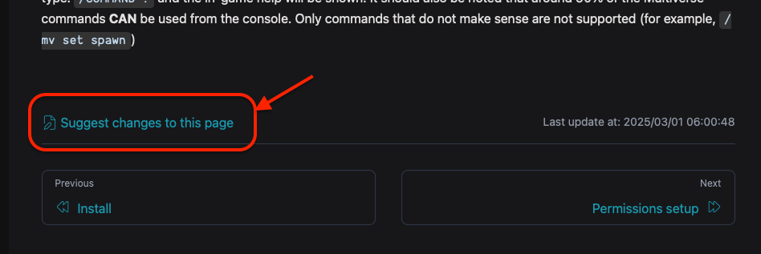
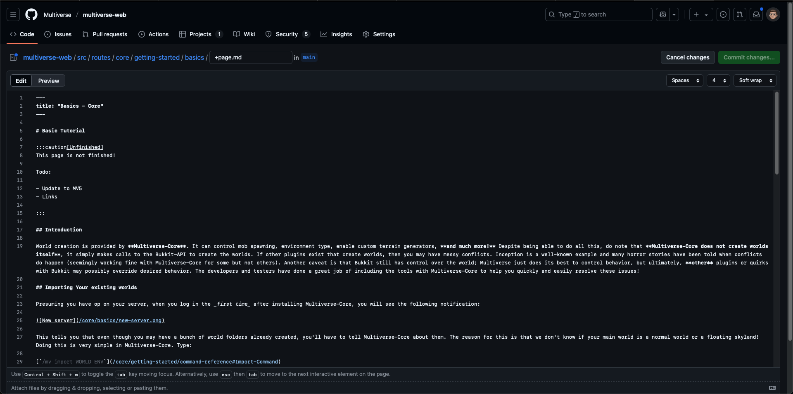
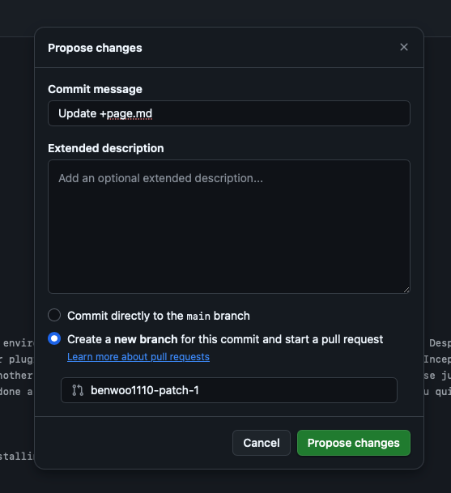
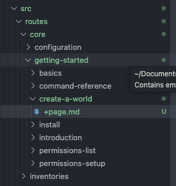
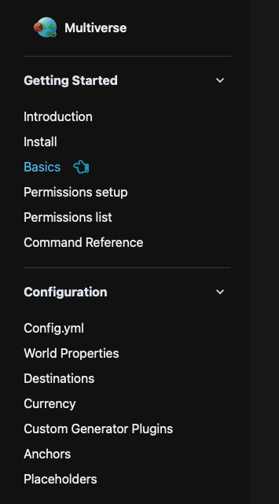
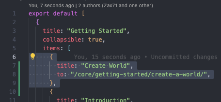

# Contributing to Multiverse's WIKI

Calling for the community to help update our wiki!!!

1. Copy over the existing my wiki from GitHub (most usage are similar) but page links format is wrong
1. Update the command usage syntax to the new mv5
1. Add on some mv5 specific new features to guide, e.g: single biome, finer teleport permissions, disabling shares, new config options

## Prerequisites

1. Create a [**GitHub**](https://docs.github.com/en/get-started/start-your-journey/creating-an-account-on-github) account!
1. The wiki uses [**markdown**](https://docs.github.com/en/get-started/writing-on-github/getting-started-with-writing-and-formatting-on-github/basic-writing-and-formatting-syntax) format, do familarise yourself with it first!

## Small additions to a single page

For small changes to a single existing page, you can click on the `Suggest changes to this page` button at the bottom of even wiki page.



This will lead you directly to the GitHub website where you can directly edit the markdown.



Once done, click on commit changes on the top right hand side. You will be prompted to create a new branch and propose changes with a new pull request. You may be asked to fork the repo first.



If you are facing issues with GitHub, you can just inform the multiverse team on the area you want to edit, and we can update the GitHub repo ourselves.

## Bigger changes and full pages additions

For bigger changes, we recommend you [**forking and cloning the repo**](https://docs.github.com/en/desktop/adding-and-cloning-repositories/cloning-and-forking-repositories-from-github-desktop) onto your computer, then making the changes in your own code editor such as [**Visual Studio Code**](https://code.visualstudio.com).

To create a new page, make a new folder, and create a file named `+page.md`. 



To add the page to the sidebar, open `./config/sidebar/<module>.js` and add a new item as shown in the screenshot below:




Once done, commit the changes and create a [**pull request**](https://docs.github.com/en/desktop/working-with-your-remote-repository-on-github-or-github-enterprise/creating-an-issue-or-pull-request-from-github-desktop#creating-a-pull-request).

## Building the website locally

You may want to build the website locally to test and view your changes first.

1. Install [nodejs](https://nodejs.org/en/download) and [pnpm](https://pnpm.io/installation)
2. Then run the following commands in terminal:
```sh
# Download deps
pnpm i

# Run the dev server
pnpm run dev
```