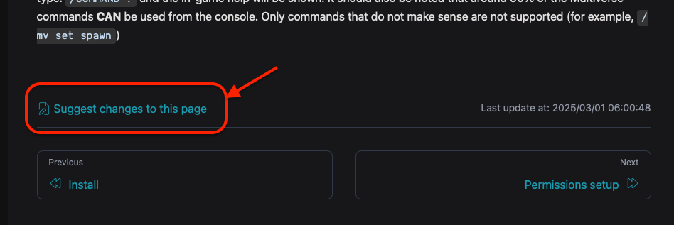
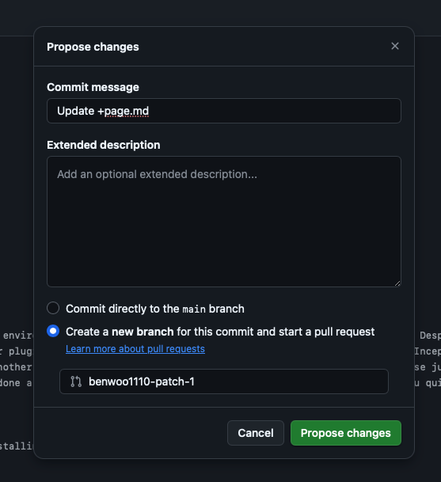
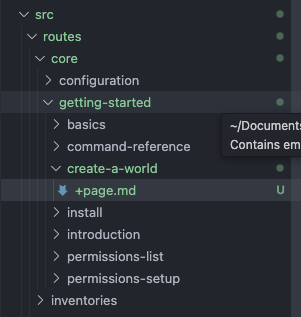
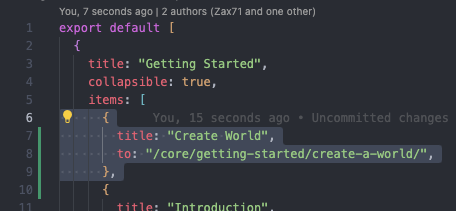
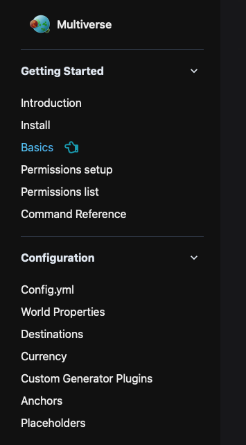

# Contributing to the Multiverse Wiki

The Multiverse wiki is community-maintained — **no coding experience required!** If you play on a server using Multiverse and spot something outdated, incorrect, or missing, you can help fix it directly from your browser.

> **Spotted a bug or have a suggestion?** [Open an issue](https://github.com/Multiverse/multiverse-web/issues) and let us know!

---

## Table of Contents

1. [Before You Start](#before-you-start)
2. [Fixing a Small Mistake on an Existing Page](#fixing-a-small-mistake-on-an-existing-page)
3. [Making Bigger Edits or Adding a New Page](#making-bigger-edits-or-adding-a-new-page)
4. [Markdown Basics](#markdown-basics)
5. [For Developers: Running the Site Locally](#for-developers-running-the-site-locally)

---

## Before You Start

You will need a free **GitHub account**. If you don't have one yet, [sign up here](https://github.com/signup) — it only takes a minute.

That's it. No software to install, no coding knowledge needed.

---

## Fixing a Small Mistake on an Existing Page

This is the easiest way to contribute. Use this for:

- Fixing typos or grammar
- Correcting outdated command syntax
- Clarifying confusing wording
- Adding a missing detail to an existing section

**Step 1** — Go to the wiki page you want to edit on [mvplugins.org](https://mvplugins.org) and scroll to the bottom. Click **"Suggest changes to this page"**.



**Step 2** — GitHub will open the file in its online editor. If prompted, click **"Fork this repository"** — this creates your own copy to make changes in.

**Step 3** — Make your edits directly in the text editor. The file uses Markdown formatting (see [Markdown Basics](#markdown-basics) below if you're unfamiliar).

**Step 4** — When you're done, click **"Commit changes"** in the top-right corner. Give your change a short description (e.g. `Fix typo in installation page`), then click **"Propose changes"**.



**Step 5** — GitHub will show a summary of your changes. Click **"Create pull request"** and submit it. A Multiverse team member will review and merge it.

> **Having trouble?** Drop a message in the [Multiverse Discord](https://discord.gg/multiverse) or [open an issue](https://github.com/Multiverse/multiverse-web/issues) describing what you want to change and we'll handle it for you.

---

## Not Sure What to Contribute? Consider Donating

If you enjoy using Multiverse but don't have anything specific to add to the wiki right now — or if writing just isn't your thing — there's another way to show your support: **a donation**.

Multiverse is maintained by volunteers in their spare time. Every donation, no matter how small, helps keep the project alive and the developers motivated to keep building and improving the plugins you rely on.

If Multiverse has ever saved you hours of server setup, made your players happy, or just worked when you needed it to — consider giving something back. It means more than you might think. ❤️

> [**GitHub Sponsors**](https://github.com/sponsors/Multiverse) · [**Open Collective**](https://opencollective.com/multiverse-plugins) — thank you for your support!

---

## Making Bigger Edits or Adding a New Page

For adding a full new page or reorganising a section, you'll work directly in GitHub without needing to install anything on your computer.

### Fork the repository

1. Go to [github.com/Multiverse/multiverse-web](https://github.com/Multiverse/multiverse-web).
2. Click the **Fork** button in the top-right corner.
3. GitHub will create a copy of the repository under your account.

### Find or create the right file

All wiki pages live inside the `src/routes/` folder. The structure mirrors the website URL:

| URL | File location |
|-----|--------------|
| `/core/fundamentals/installation` | `src/routes/core/fundamentals/installation/+page.md` |
| `/inventories/reference/faq` | `src/routes/inventories/reference/faq/+page.md` |

**To edit an existing page** — navigate to the file in your forked repo and click the pencil (edit) icon.

**To create a new page:**
1. Navigate to the correct folder inside `src/routes/`.
2. Click **"Add file"** → **"Create new file"**.
3. Name the file `<your-page-name>/+page.md` (the folder name becomes the URL slug).



### Page file format

Every page starts with a small header block followed by your content:

```markdown
---
title: "Your Page Title"
---

## First Section

Your content goes here...
```

The `title` field controls what appears in the browser tab and sidebar.

### Add the page to the sidebar

New pages won't appear in the navigation menu automatically. You need to register them in the sidebar config.

1. Open the `config/sidebar/` folder and find the file matching the plugin section you're adding to (e.g. `core.js`, `inventories.js`).
2. Add a new entry following the same pattern as the existing items.



This is what the result looks like on the website:



### Submit your changes

Once you're happy with your edits:

1. Commit each file change with a short description.
2. Go to your forked repository on GitHub.
3. Click **"Contribute"** → **"Open pull request"**.
4. Write a brief summary of what you added or changed, then submit.

A Multiverse team member will review your pull request and may leave comments or suggestions before merging.

---

## Markdown Basics

Wiki pages are written in **Markdown** — a simple way to format text using plain characters. Here's a quick reference:

```markdown
## Section heading

### Sub-section heading

Regular paragraph text.

**Bold text** and *italic text*.

- Bullet point one
- Bullet point two

1. Numbered step one
2. Numbered step two

`inline code` for commands and config values

```
code block for longer examples
```

[Link text](https://example.com)


```

GitHub has a [full guide to Markdown](https://docs.github.com/en/get-started/writing-on-github/getting-started-with-writing-and-formatting-on-github/basic-writing-and-formatting-syntax) if you want to go deeper.

---

## For Developers: Running the Site Locally

If you want to preview your changes in a live browser before submitting, you can run the site on your own machine.

### Prerequisites

- [Node.js](https://nodejs.org/en/download) (LTS version recommended)
- [pnpm](https://pnpm.io/installation)

### Setup

```sh
# Clone your fork
git clone https://github.com/<your-username>/multiverse-web.git
cd multiverse-web

# Install dependencies
pnpm i

# Start the development server
pnpm run dev
```

Open [http://localhost:5173](http://localhost:5173) in your browser. The site hot-reloads as you edit files, so you can see changes instantly.

### Building for production

```sh
pnpm run build
```

The output is written to the `dist/` folder.

### Project structure

```
src/routes/          ← Wiki pages (Markdown files)
config/sidebar/      ← Navigation sidebar config
static/              ← Images and other static assets
```

When adding images to a page, place them in `static/<section>/` and reference them in Markdown as `/<section>/image-name.png`.
